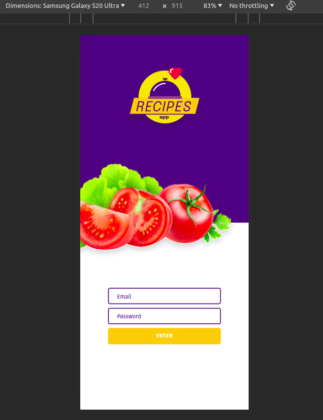
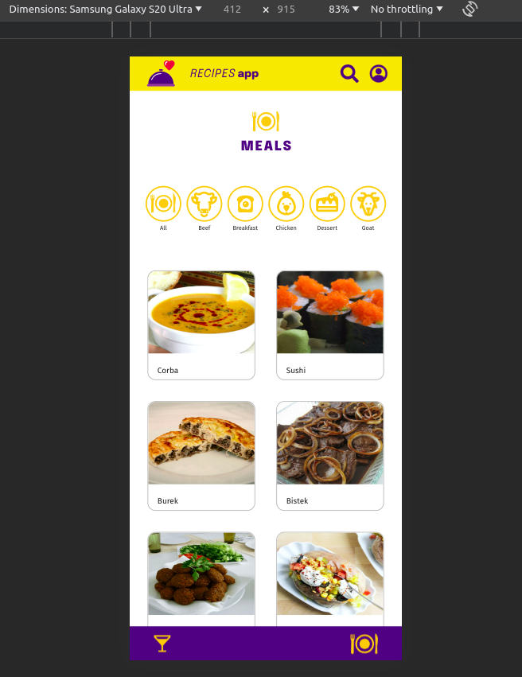
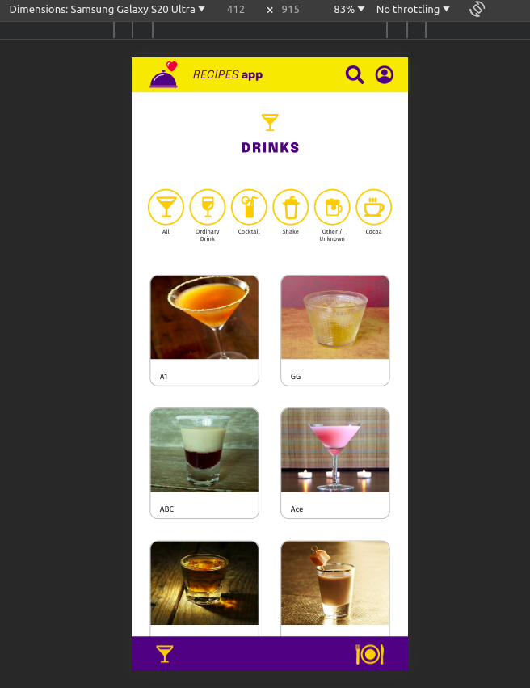
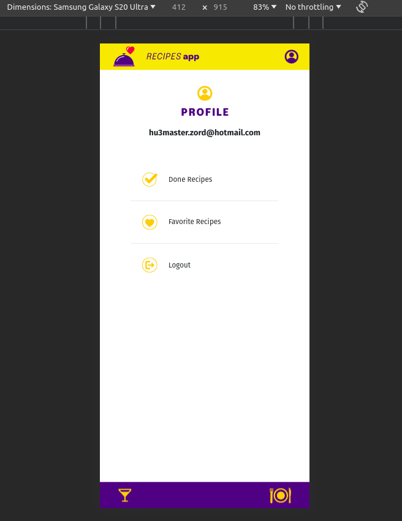
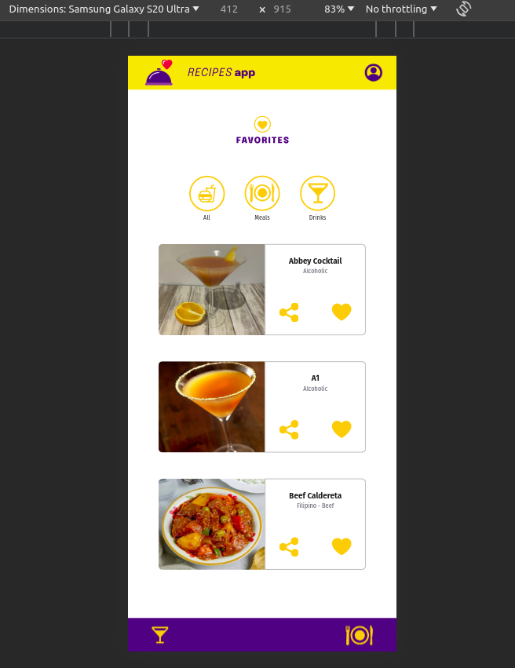
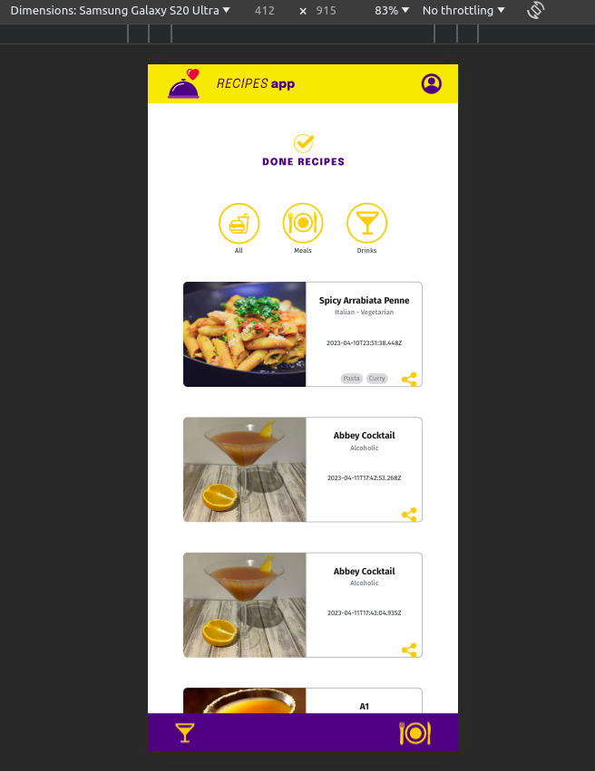
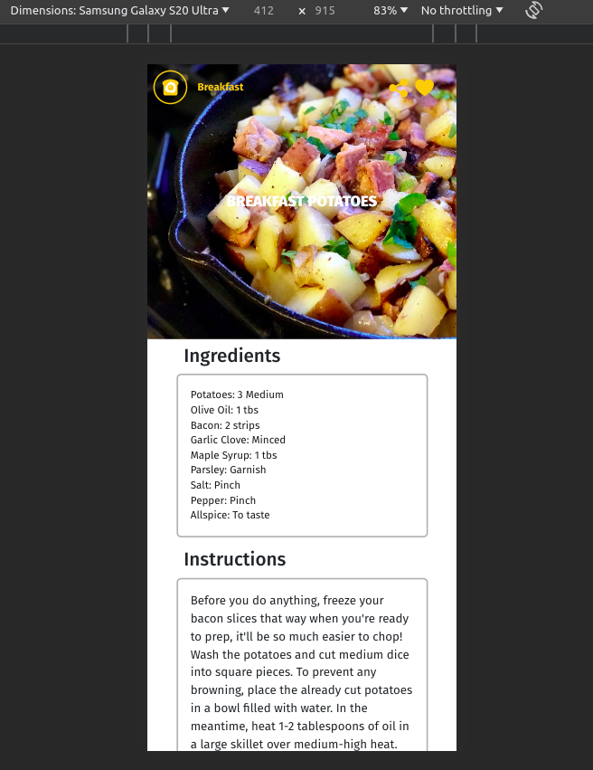

# App de Receitas

## Descrição

Bem-vindo ao Food & Drink App, onde você pode descobrir, salvar e fazer receitas deliciosas!

## Tecnologias utilizadas

- React
- React Router
- Redux e Redux Thunk
- React Hooks
- Tailwind CSS
- React Testing Library

## Soft Skills

Além das habilidades técnicas necessárias para o desenvolvimento deste projeto, a equipe enfatiza e valoriza as seguintes soft skills:

### 1. Comunicação Efetiva

A comunicação é a chave para o sucesso da equipe. Garantimos que todos os membros estejam alinhados, compartilhando informações de forma clara e eficaz.

### 2. Colaboração

A colaboração é essencial para a construção de um ambiente de trabalho saudável. Encorajamos a troca de ideias, a resolução conjunta de problemas e o apoio mútuo.

### 3. Ferramentas Utilizadas

Utilizamos as seguintes ferramentas para a gestão do projeto:

- **Zoom:** Realizamos reuniões diárias (Daily Scrums) para manter a equipe atualizada e alinhada.
- **Trello:** Organizamos tarefas, acompanhamos o progresso e evitamos conflitos nos git pushs.

### 4. Colaboradores

Conheça os membros dedicados que contribuíram para o sucesso deste projeto:

- [Andre Albernaz](https://github.com/albernazandre)
- [Roger Montero](https://github.com/roger-mont)
- [Gabriel Yamazato](https://github.com/gabrielyamazato)
- [Fabrício Floriano](https://github.com/FabricioFloriano)
- [Marcelline Oliveira](https://github.com/Marcellinefanny)
- [Gabriel Fernandes](https://github.com/GabrielFeBe)

## Como rodar o projeto localmente

1. Clone o repositório

```bash
git clone git@github.com:GabrielFeBe/App-De-Receitas.git
```

2. Entre na pasta do repositório que você acabou de clonar:

```bash
cd App-De-Receitas
```

3. Instale as dependências:

```bash
npm install
```

4. Inicie o projeto:

```bash
npm start
```

5. Acesse o projeto no seu navegador em `http://localhost:3000`

## Projeto em deploy

- Fiz o deploy no vercel, você pode acessar o projeto [clicando aqui](https://app-de-receitas-kappa.vercel.app/)

## Páginas

### 1. Login

A página de login é simples e permite aos usuários entrar na plataforma. Os dados são armazenados no Local Storage.

<details>
  <summary>Detalhes do Login</summary>


- **Funcionalidades:**

  - Entrar na plataforma.
  - Armazenamento local de dados.

- **Instruções:**
  - Insira suas credenciais e clique no botão de login.

</details>

### 2. Meal

A página Meal oferece opções de receitas. Você pode explorar receitas ou pesquisar por filtros disponíveis.

<details>
  <summary>Detalhes da Página de Meal</summary>


- **Funcionalidades:**

  - Explorar receitas de comida.
  - Pesquisar receitas por filtros.

- **Instruções:**
  - Escolha uma receita ou use a pesquisa para encontrar algo específico.

</details>

### 3. Drinks

A página Drinks é semelhante à Meal, mas focada em bebidas. Explore e descubra novas bebidas.

<details>
  <summary>Detalhes da Página de Drinks</summary>



- **Funcionalidades:**

  - Explorar receitas de bebidas.
  - Pesquisar bebidas por filtros.

- **Instruções:**
  - Escolha uma bebida ou use a pesquisa para encontrar algo específico.

</details>

### 4. Perfil

A página de Perfil contém links para receitas feitas, favoritas e opção de logout.

<details>
  <summary>Detalhes da Página de Perfil</summary>



- **Funcionalidades:**

  - Acesso a receitas feitas.
  - Acesso a receitas favoritas.
  - Logout.

- **Instruções:**
  - Explore suas receitas feitas e favoritas.

</details>

### 5. Favorite Recipes

A página de Receitas Favoritas exibe as receitas que você marcou como favoritas.

<details>
  <summary>Detalhes da Página de Favorite Recipes</summary>


- **Funcionalidades:**

  - Visualizar receitas marcadas como favoritas.

- **Instruções:**
  - Explore suas receitas favoritas.

</details>

### 6. Done Recipes

A página de Receitas Feitas exibe as receitas que você concluiu com sucesso.

<details>
  <summary>Detalhes da Página de Done Recipes</summary>



- **Funcionalidades:**

  - Visualizar receitas concluídas.

- **Instruções:**
  - Explore suas receitas feitas.

</details>

### 7. Recipe Details

A página de detalhes da receita exibe informações detalhadas sobre uma receita específica.

<details>
  <summary>Detalhes da Página de Recipe Details</summary>



- **Funcionalidades:**

  - Visualizar detalhes da receita.
  - Favoritar uma receita.
  - Iniciar uma receita.
  - Receitas recomendadas para serem feitas com a atual.
  - Vídeo de instruções.

- **Instruções:**
  - Clique no coração para favoritar uma receita.
  - Clique no botão de iniciar receita para começar a fazer a receita.

</details>

### 8. Recipe In Progress

A página Recipe In Progress permite marcar itens enquanto você faz uma receita.

<details>
  <summary>Detalhes da Página de Recipe In Progress</summary>


- **Funcionalidades:**

  - Checklist para receitas.
  - Finalizar uma receita em progresso.

- **Instruções:**
  - Marque os itens conforme você os conclui.

</details>
